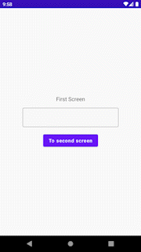

# Compose-Navigation-With-Arguments

<div align="left">
 
</div>

## İçindekiler
* [Proje Hakkında](#proje-hakkında)
* [Açıklama](#açıklama)
  * [Temel kullanım](#temel-kullanım)
  * [Argümanın gönderilmesi ve alınması](#argümanın-gönderilmesi-ve-alınması)
  * [Optional Arguments ve argümanlara özellik eklenmesi](#optional-arguments-ve-argümanlara-özellik-eklenmesi) 
* [Teknolojiler](#teknolojiler)
* [License](#license)
* [Iletişim](#iletişim)

## Proje Hakkında
Bu proje, sadece Navigation Component teknolojisinin argümanlar ile kullanımını göstermek için Jetpack Compose ile geliştirilen temel bir Android uygulamasıdır.

## Açıklama

### Temel kullanım

Navigasyonda hangi ekranların olacağını belirleyebilmek için önce bir NavHost oluşturmak gerekiyor. Fakat NavHost'ta bir parametre olarak NavController kullanılacağı için önce bir navController instance oluşturuyoruz.

```kotlin
val navController = rememberNavController()
```

Ardından NavHost'u yazmaya başlayabiliriz. NavHost, az önce oluştruduğumuz NavController ve bir başlangıç noktası olmak üzere 2 parametre alıyor. Bu başlangıç noktasının adı, NavHost'un lambdası içinde oluşturacağımız yapının içindeki elemanlardan biri olmalıdır.

```kotlin
NavHost(navController = navController, startDestination = "FirstScreen" )
```

FirstScreen Composable'ının navigasyon yapısı aşağıdaki şekilde oluşturuluyor. Burada composable() metodu içinde String şeklinde yazılan ifade "FirstScreen", temsil ettiği Composable ekrana navigate ederken kullanılacak syntaxi arz etmektedir. startDestination olarak da yine bu ekranı belirliyoruz.

```kotlin
NavHost(navController = navController, startDestination = "FirstScreen" ){
    composable("FirstScreen"){ FirstScreen(navController = navController)}
}
```

Örneğin başka bir ekrandan FirstScreen ekranına:
```kotlin
navController.navigate("FirstScreen")
```
şeklinde navigasyon işlemini gerçekleştireceğiz.

Yukarıda composable() metodunun lambda kapmsamında bulunan FirstScreen(navController = navController) ifadesi Composable'ın kendisidir. Yani bu Composable, NavController tipinde navController parametresi almaktadır. İşte bu sayede bu parametre ile navController.navigate("rota") şeklinde navigation işlemini gerçekleştireceğiz.
```kotlin
@Composable
fun FirstScreen(navController: NavController)
```

### Argümanın gönderilmesi ve alınması

İlk ekrandan ikinci ekrana giderken ilk ekrandaki bir TextField vasıtası ile String göndereceğiz. Bunun için de rota/{stringArgumani} şeklinde syntax kullanılıyor.

```kotlin
NavHost(navController = navController, startDestination = "FirstScreen" ){
    composable("FirstScreen"){ FirstScreen(navController = navController)}

    composable("SecondScreen/{someString}"){backStackEntry ->
        SecondScreen(navController = navController, backStackEntry.arguments?.getString("someString"))
    }
}
```

Görüldüğü üzere lambdada backStackEntry'den getString() fonksiyonu ile someString argümanındaki Stringi alıyoruz ve bunu SecondScreen'e veriyoruz.

```kotlin
@Composable
fun SecondScreen(navController: NavController, someString: String?)
```

Örneğin bir ekrandan SecondScreen ekranına:
```kotlin
navController.navigate("SecondScreen/${birStringDeğisken}")
```
şeklinde navigasyon işlemini gerçekleştireceğiz.

Bu syntax kullanımında argüman null veya boş String gönderilemez, hata oluşacaktır. Bunun çözümü ise dokümantasyonda Optional Arguments (İsteğe Bağlı Argüman) olarak geçen yapıyı kullanmaktır. Bu yapıyı da üçüncü bir Composable ekran ile oluşturalım ve bir de null olabilme özelliği ekleyelim.

### Optional Arguments ve argümanlara özellik eklenmesi

```kotlin
NavHost(navController = navController, startDestination = "FirstScreen" ){
    composable("FirstScreen"){ FirstScreen(navController = navController)}

    composable("SecondScreen/{someString}"){backStackEntry ->
        SecondScreen(navController = navController, backStackEntry.arguments?.getString("someString"))
    }

    composable(
        "ThirdScreen?someString={someString}", //Optional Argument
        arguments = listOf(
            navArgument("someString"){
                nullable = true
            })
    ){ backStackEntry ->
        ThirdScreen(navController = navController, backStackEntry.arguments?.getString("someString"))
    }
}
```

```kotlin
composable("ThirdScreen?someString={someString}", arguments = listOf(navArgument("someString"){nullable = true}))
```

Görüldüğü üzere composable() metodunun bir de arguments parametresi bulunmakta. Bu sayede argümanlara yukarıdaki syntax ile null olabilme (nullability), varsayılan değer (defaultValue) gibi başka özellikler tanımlayabiliyoruz. Optional Argument özelliğini kullandığımız için bu String boş da olsa hata oluşturmayacaktır. Nullable özelliğini de true yaptığımız için artık bu argüman null da olabilir. Bir sonraki ekranda yine bu yöntemle argümanın tipini Integer yapacağız. Compose'da Navigation Component'in varsayılan tipi String tipidir.

ThirdScreen'e:
```kotlin
navController.navigate("ThirdScreen?someString=${text}")
```
şeklinde navigasyon işlemini gerçekleştirebiliriz.

Şimdi dördüncü ekran için argüman tipini Integer yapalım:

```kotlin
NavHost(navController = navController, startDestination = "FirstScreen" ){
    composable("FirstScreen"){ FirstScreen(navController = navController)}

    composable("SecondScreen/{someString}"){backStackEntry ->
        SecondScreen(navController = navController, backStackEntry.arguments?.getString("someString"))
    }

    composable(
        "ThirdScreen?someString={someString}",
        arguments = listOf(
            navArgument("someString"){
                nullable = true
            })
    ){ backStackEntry ->
        ThirdScreen(navController = navController, backStackEntry.arguments?.getString("someString"))
    }

    composable(//Argüman tipini değiştirelim.
        "FourthScreen/{someInteger}",
        arguments = listOf(navArgument("someInteger"){
            type = NavType.IntType
        })
    ){backStackEntry ->
        FourthScreen(navController = navController, backStackEntry.arguments?.getInt("someInteger"))
    }
}
```

## Teknolojiler
* [Navigation Component](https://developer.android.com/jetpack/compose/navigation) - Daha fazla bilgi için
* [Jetpack Compose](https://developer.android.com/jetpack/compose)


## License
```xml
   Copyright 2022 Mustafa Utku Ensert

   Licensed under the Apache License, Version 2.0 (the "License");
   you may not use this file except in compliance with the License.
   You may obtain a copy of the License at

       http://www.apache.org/licenses/LICENSE-2.0

   Unless required by applicable law or agreed to in writing, software
   distributed under the License is distributed on an "AS IS" BASIS,
   WITHOUT WARRANTIES OR CONDITIONS OF ANY KIND, either express or implied.
   See the License for the specific language governing permissions and
   limitations under the License.
```


## Iletişim
* [ensertyazilim@gmail.com](#)
